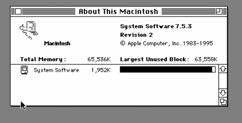

# Proxmox Mac Classic

Thin Debian-based Proxmox templates that boot straight into classic Macintosh emulation, with a dedicated Mac hard disk, a transfer disk, and removable media slots driven by additional Proxmox virtual disks.

This repo currently documents and ships the working `Basilisk II` template flow that became Proxmox template `260` on the reference host.



## Quickstart

This quickstart assumes:

- Proxmox VE host is reachable over SSH
- you already have SSH key access to the host
- you have legal access to your own Old World Mac ROMs and classic Mac OS disk images
- you want the same basic layout used in the working reference template

### 1. Build the guest asset bundle

From this repo:

```bash
./scripts/build-retro-mac-templates.sh
```

The script builds a thin Debian appliance and imports it into Proxmox.

### 2. Create the reference template layout

The working `Basilisk II` template layout is:

- `scsi0`: Linux appliance OS disk
- `scsi1`: persistent data disk (`RETRODATA`)
- `scsi2`: removable media slot
- `scsi3`: dedicated Mac hard disk (`Macintosh HD`)

Reference template:

- VMID `260`
- name `retro-mac-basilisk-template`

### 3. Clone the template

Example:

```bash
ssh root@192.168.0.12 'qm clone 260 362 --name retro-mac-basilisk-install-test --full 1 && qm start 362'
```

Each clone gets its own unique copy of:

- `scsi0`
- `scsi1`
- `scsi2`
- `scsi3`

That means each clone has its own independent `Macintosh HD`.

### 4. Put Mac media on the removable media slot

The appliance scans extra Proxmox media disks and attaches classic Mac images automatically.

For the current template shape:

- `scsi2` is the removable media slot
- format it with a normal Linux filesystem such as `ext4`
- copy Mac media files onto it

Supported file types:

- `.img`
- `.dsk`
- `.hfv`
- `.hda`
- `.toast`
- `.iso`

The working reference media disk currently uses:

- `001-System7_5_3.img`

### 5. Boot in the Proxmox graphical console

The appliance is optimized for the Proxmox console rather than browser noVNC.

Open the clone in the normal Proxmox graphical console, not the serial console.

What you should see:

- removable startup/helper media from `scsi2`
- `Macintosh HD` from `scsi3`
- `Mac Exchange`

### 6. Install into `Macintosh HD`

Use the helper media to install or copy a system onto `Macintosh HD`.

Once the clone boots cleanly from `Macintosh HD`, you can:

- remove the helper media from `scsi2`
- snapshot the VM
- promote that clone into a richer gold master template

## What This Repo Includes

- Proxmox build automation under [`scripts/build-retro-mac-templates.sh`](scripts/build-retro-mac-templates.sh)
- guest runtime files under [`retro-mac/guest-files`](retro-mac/guest-files)
- architecture and design docs under [`docs/`](docs)

## What You Must Supply

This repo does not ship:

- Apple ROMs
- Apple system software
- copyrighted installer disks

You must provide your own legally owned ROMs and Mac OS media.

## Docs

- [Architecture](docs/architecture.md)
- [Media Model](docs/media-model.md)
- [Implementation Decisions](docs/decisions.md)
- [Replication Guide](docs/replication.md)
- [Operations Guide](docs/operations.md)

